# Architecture Documentation - Team Metrics Dashboard

**Last Updated**: January 16, 2026

---

## Table of Contents

1. [System Overview](#system-overview)
2. [Component Architecture](#component-architecture)
3. [Data Flow](#data-flow)
4. [DORA Metrics Pipeline](#dora-metrics-pipeline)
5. [Caching Strategy](#caching-strategy)
6. [Deployment Architecture](#deployment-architecture)

---

## System Overview

The Team Metrics Dashboard is a Python-based application that collects, processes, and visualizes engineering team metrics from GitHub and Jira.

### High-Level Architecture

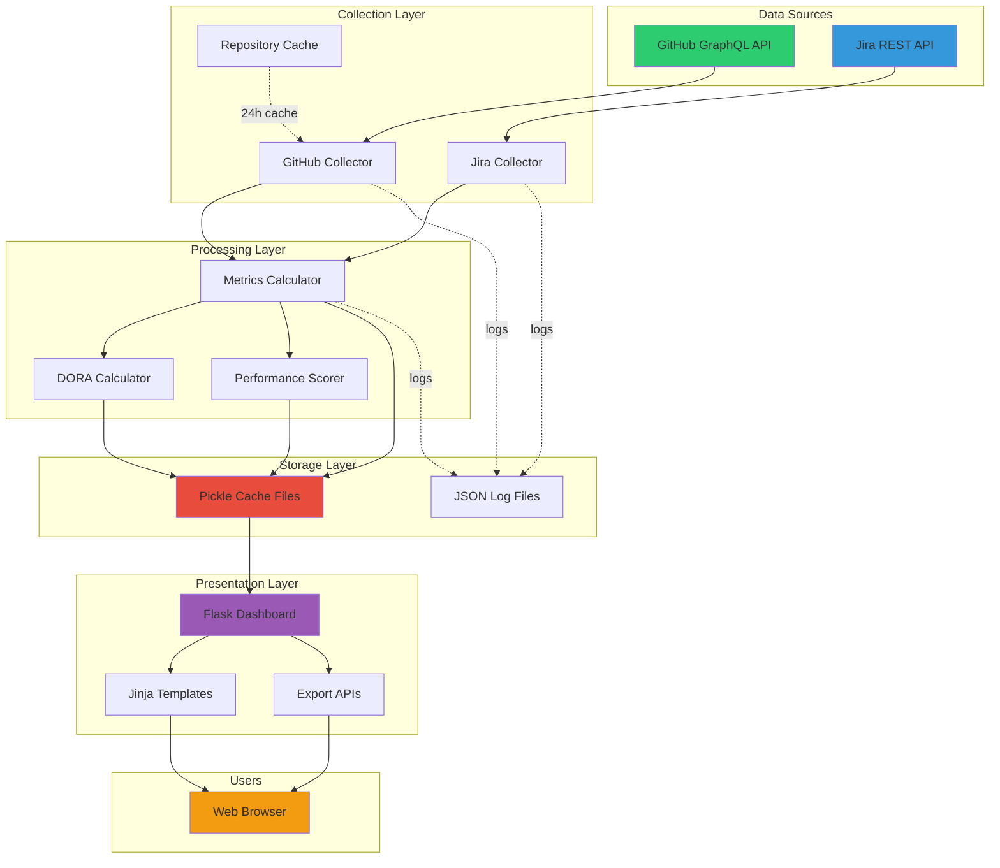

---

## Component Architecture

### Collectors

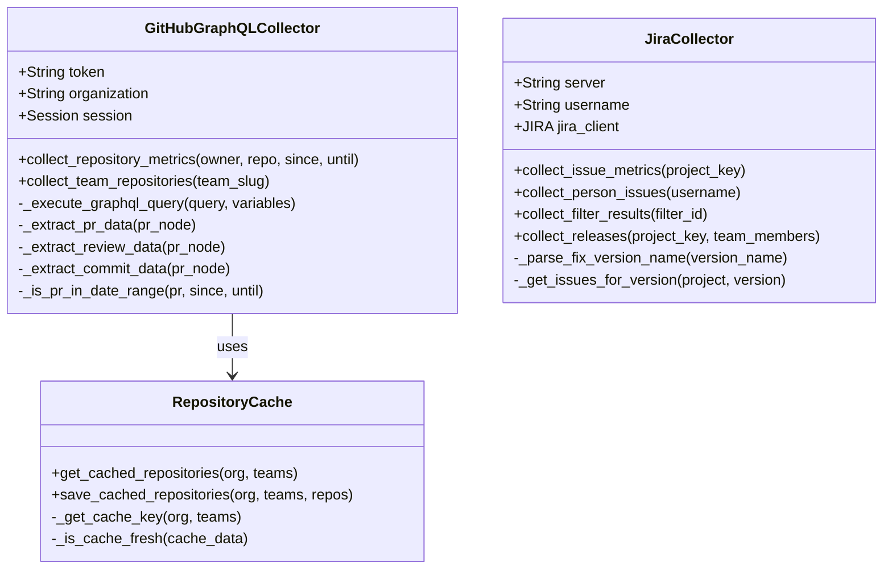

### Models

The metrics calculation system is organized into 4 focused modules using mixin inheritance and delegation patterns:

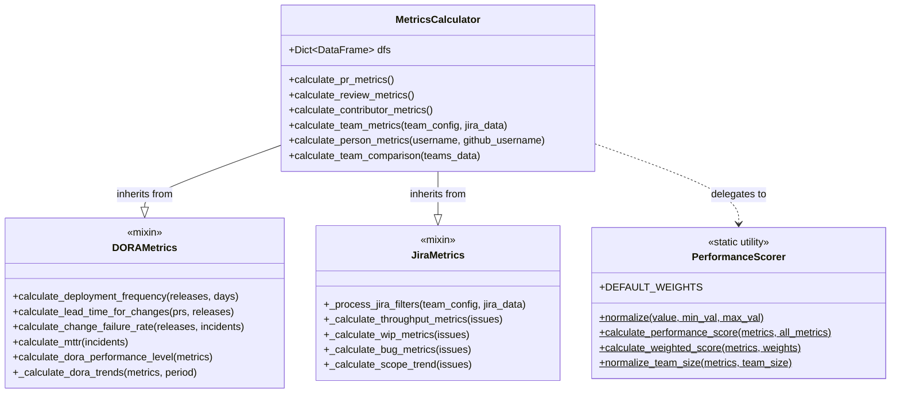

**Module Organization:**
- **metrics.py** (605 lines) - Core MetricsCalculator with orchestration logic
- **dora_metrics.py** (635 lines) - DORAMetrics mixin for DevOps Research metrics
- **jira_metrics.py** (226 lines) - JiraMetrics mixin for Jira filter processing
- **performance_scoring.py** (270 lines) - PerformanceScorer static class for scoring utilities

---

## Data Flow

### Collection to Dashboard Flow

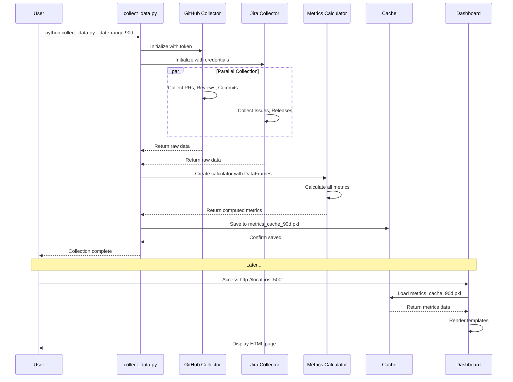

### Parallel Collection Strategy

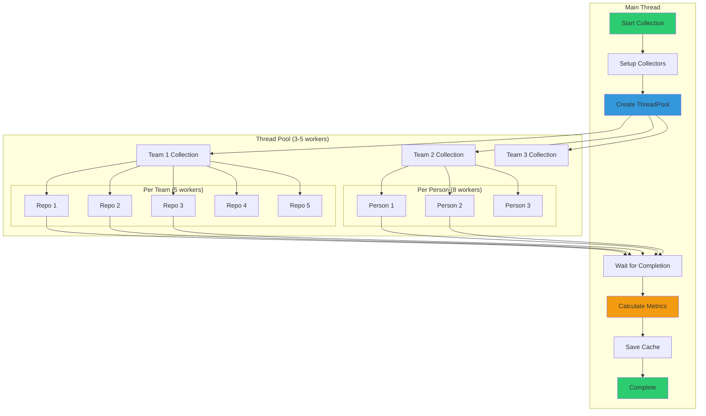

---

## DORA Metrics Pipeline

### DORA Calculation Flow

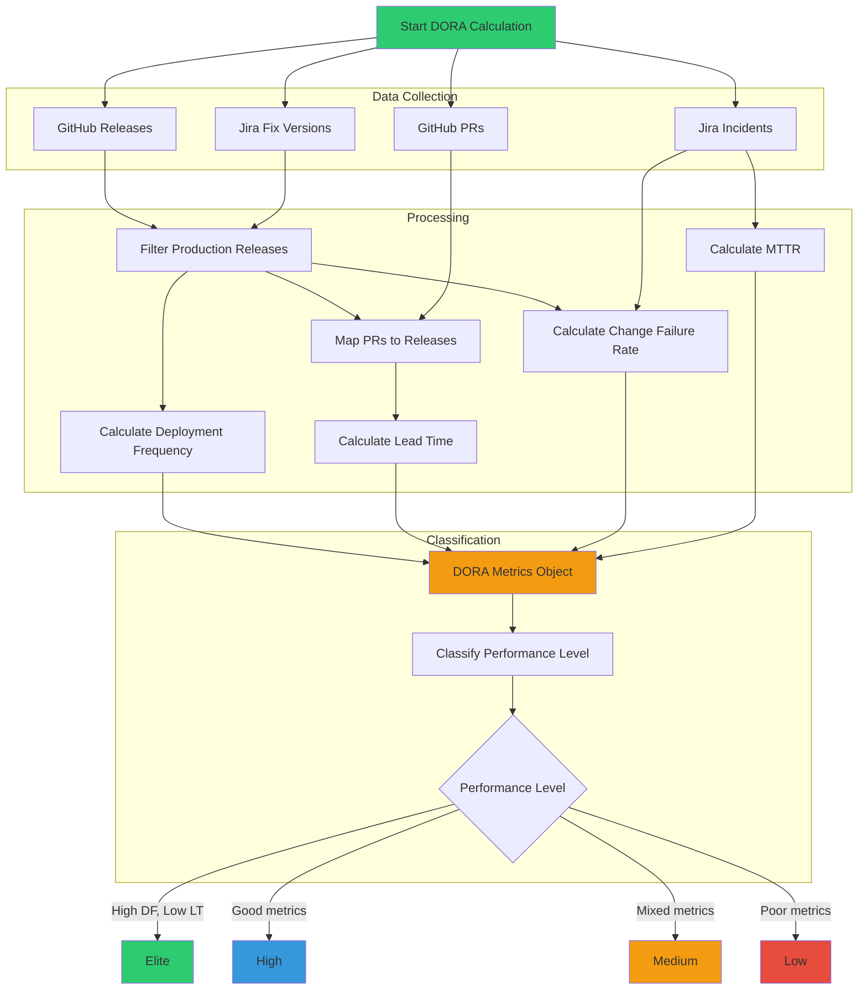

### Release Filtering Logic

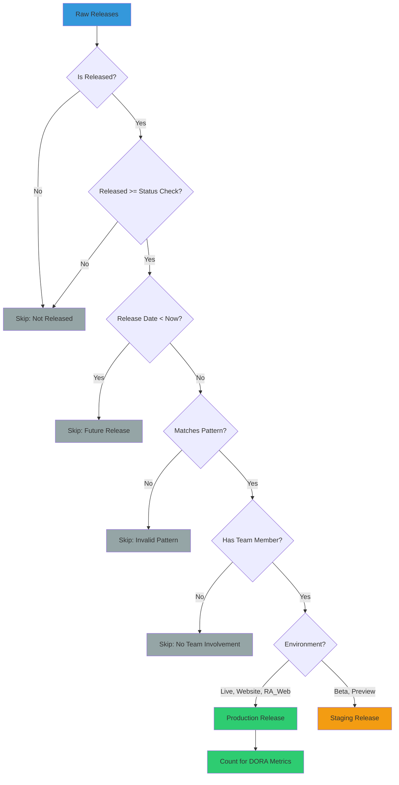

---

## Caching Strategy

### Cache Layers

```mermaid
graph TB
    subgraph "Repository Cache (24h)"
        RC_KEY[Cache Key: MD5(org+teams)]
        RC_FILE[JSON File]
        RC_CHECK{Fresh?}
    end

    subgraph "Metrics Cache (User-defined)"
        MC_KEY[Cache Key: date_range]
        MC_FILE[Pickle File]
        MC_AGE{Age < duration?}
    end

    subgraph "Dashboard Memory Cache"
        DM_DATA[In-Memory Data]
        DM_TS[Timestamp]
    end

    APP[Application]
    
    APP -->|Request repos| RC_CHECK
    RC_CHECK -->|Yes| RC_FILE
    RC_CHECK -->|No| API1[GitHub API]
    API1 --> RC_FILE
    
    APP -->|Request metrics| MC_AGE
    MC_AGE -->|Yes| MC_FILE
    MC_AGE -->|No| COLLECT[Run Collection]
    COLLECT --> MC_FILE
    
    MC_FILE --> DM_DATA
    DM_TS -->|Check age| MC_AGE
    
    style RC_FILE fill:#3498db
    style MC_FILE fill:#e74c3c
    style DM_DATA fill:#9b59b6
    style API1 fill:#95a5a6
    style COLLECT fill:#f39c12
```

### Cache Filename Strategy

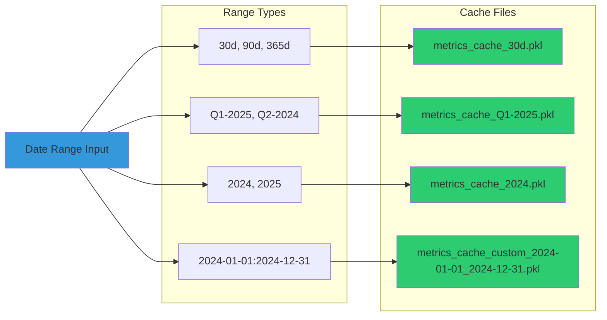

---

## Deployment Architecture

### Local Development

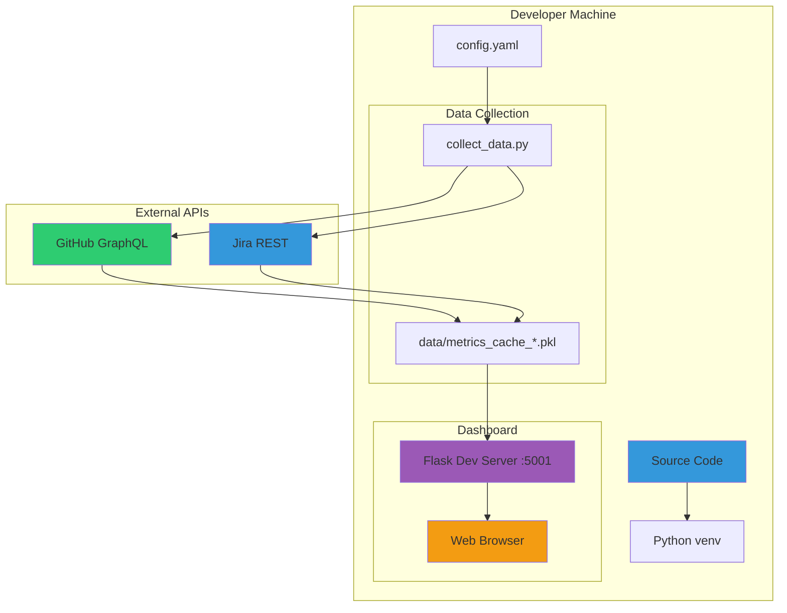

### macOS Service Deployment

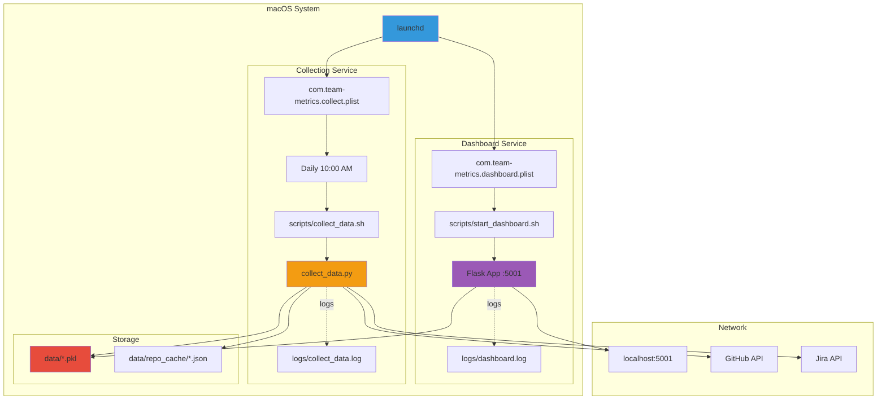

---

## Directory Structure

```
team_metrics/
├── src/
│   ├── collectors/          # Data collection
│   │   ├── github_graphql_collector.py
│   │   └── jira_collector.py
│   ├── models/              # Metrics calculation (4 focused modules)
│   │   ├── __init__.py                  # Backward compatibility exports
│   │   ├── metrics.py                   # Core MetricsCalculator (605 lines)
│   │   ├── dora_metrics.py              # DORAMetrics mixin (635 lines)
│   │   ├── jira_metrics.py              # JiraMetrics mixin (226 lines)
│   │   └── performance_scoring.py       # PerformanceScorer utilities (270 lines)
│   ├── dashboard/           # Flask app
│   │   ├── app.py
│   │   ├── templates/
│   │   └── static/
│   └── utils/               # Utilities
│       ├── date_ranges.py
│       ├── jira_filters.py
│       ├── repo_cache.py
│       └── logging/
├── tests/                   # Test suites
│   ├── unit/
│   ├── collectors/
│   ├── dashboard/
│   └── integration/
├── config/                  # Configuration
│   ├── config.yaml
│   └── logging.yaml
├── data/                    # Cache files
│   ├── metrics_cache_*.pkl
│   └── repo_cache/
├── logs/                    # Application logs
│   ├── team_metrics.log
│   └── team_metrics_error.log
├── docs/                    # Documentation
│   ├── ARCHITECTURE.md
│   ├── API_DOCUMENTATION.md
│   └── TESTING.md
└── scripts/                 # Helper scripts
    ├── start_dashboard.sh
    └── collect_data.sh
```

---

## Performance Optimizations

### Optimization Stack

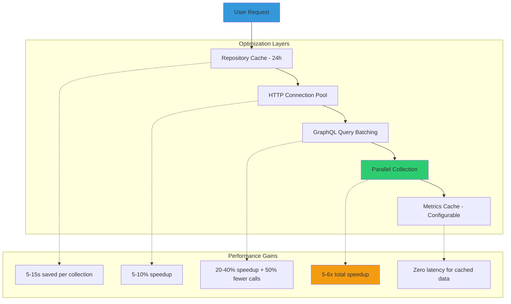

---

## Technology Stack

| Layer | Technology | Purpose |
|-------|-----------|---------|
| **Frontend** | Jinja2 + HTML/CSS/JS | Template rendering |
| **Charts** | Plotly.js | Interactive visualizations |
| **Backend** | Flask | Web framework |
| **Data Processing** | pandas | Metrics calculation |
| **APIs** | requests + GraphQL | Data collection |
| **Caching** | pickle + JSON | Data persistence |
| **Logging** | Python logging | Structured logs |
| **Testing** | pytest | Unit & integration tests |
| **CI/CD** | GitHub Actions | Automated testing |
| **Deployment** | launchd (macOS) | Service management |

---

## Security Considerations

1. **API Tokens**: Stored in `config.yaml` (gitignored)
2. **SSL Verification**: Optional for Jira (self-signed certs)
3. **Rate Limiting**: Built-in retry logic for GitHub API
4. **Input Validation**: All user inputs validated before processing
5. **XSS Protection**: Jinja2 auto-escaping enabled
6. **CORS**: Not required (same-origin policy)

---

## Scalability

### Current Limits

- **Teams**: Tested with 3-5 teams
- **Repositories**: Tested with 50+ repos per team
- **History**: 90-365 days of data
- **Team Members**: 5-15 members per team
- **API Calls**: ~1000-2000 per collection

### Scaling Strategies

1. **More Aggressive Caching**: Extend cache duration
2. **Incremental Updates**: Only fetch new data since last collection
3. **Database Backend**: Replace pickle with PostgreSQL/SQLite
4. **Async Collection**: Use asyncio instead of threads
5. **Multiple Instances**: Run separate instances per team

---

For more information, see:
- [API_DOCUMENTATION.md](API_DOCUMENTATION.md) - API reference
- [CLAUDE.md](../CLAUDE.md) - Development guide
- [README.md](../README.md) - Project overview
